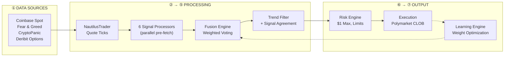

# 🤖 Polymarket BTC 15-Minute Trading Bot

[](https://www.python.org/downloads/)
[](https://nautilustrader.io/)
[](https://opensource.org/licenses/MIT)
[](https://polymarket.com)
[](https://redis.io/)
[](https://grafana.com/)

A production-grade algorithmic trading bot for **Polymarket's 15-minute BTC price prediction markets**. Built with a 7-phase architecture combining 6 signal processors, a weighted fusion engine, trend-following with signal agreement, and self-learning weight optimization.

---

## 📋 Table of Contents

- [Features](#-features)
- [Architecture](#-architecture)
- [Signal Processors](#-signal-processors)
- [Prerequisites](#-prerequisites)
- [Quick Start](#-quick-start)
- [Configuration](#-configuration)
- [Running the Bot](#-running-the-bot)
- [Project Structure](#-project-structure)
- [FAQ](#-faq)
- [Disclaimer](#-disclaimer)

---

## ✨ Features

| Feature | Description |
|---------|-------------|
| **7-Phase Architecture** | Modular pipeline: Data → Ingestion → NautilusTrader → Signals → Fusion → Risk → Execution |
| **6 Signal Processors** | Spike Detection, Sentiment, Price Divergence, Order Book Imbalance, Tick Velocity, Deribit PCR |
| **Trend + Signal Agreement** | Late-window trend filter (min 13) with configurable signal agreement gate |
| **Parallel Data Fetching** | Sentiment, spot price, orderbook, and Deribit data fetched via `asyncio.gather` |
| **Self-Learning Weights** | Learning engine attributes trades to signal sources and optimizes fusion weights |
| **Risk-First Design** | $1 max per trade, daily loss limits, drawdown controls, daily stats auto-reset |
| **Dual-Mode Operation** | Toggle simulation ↔ live via Redis without restart |
| **Real-Time Monitoring** | Grafana dashboards + Prometheus metrics |
| **Paper Trading** | Full binary-outcome P&L simulation with probabilistic model |

---

## 🏗️ Architecture

### 7-Phase Pipeline



### Trade Decision Flow

1. **Tick Processing** — `on_quote_tick` stores float prices in a `deque(maxlen=500)`
2. **Trade Window** — At minutes 13–14 of each 15-min market, triggers decision
3. **Context Fetch** — `asyncio.gather` fetches sentiment + spot + orderbook + Deribit PCR in parallel
4. **Signal Generation** — 6 processors run on pre-fetched data (no blocking HTTP)
5. **Fusion** — Weighted combination with configurable weights per processor
6. **Trend Filter** — Price > 0.60 → buy YES, price < 0.40 → buy NO, else skip
7. **Signal Agreement** — If fused direction disagrees with trend → skip (configurable)
8. **Risk Check** — Position count, exposure, daily loss, drawdown limits
9. **Execute** — Place order or record paper trade

---

## 📡 Signal Processors

| Processor | Weight | Signal Type | Data Source |
|-----------|--------|-------------|-------------|
| **TickVelocity** | 25% | Momentum (30s/60s probability velocity) | Polymarket tick buffer |
| **OrderBookImbalance** | 25% | Volume surge (bid/ask depth imbalance) | Polymarket CLOB (pre-fetched) |
| **DeribitPCR** | 15% | Put/call ratio (institutional sentiment) | Deribit API (5-min cache) |
| **SpikeDetection** | 15% | Mean-reversion (MA deviation + velocity) | Price history |
| **PriceDivergence** | 10% | Spot momentum vs probability mispricing | Coinbase spot |
| **SentimentAnalysis** | 10% | Fear & Greed + news sentiment | Alternative.me + CryptoPanic |

All weights are configurable via `config.py` → `SIGNAL_WEIGHTS` dict.

---

## 📦 Prerequisites

- **Python 3.14+** — [Download](https://www.python.org/downloads/)
- **Redis** — [Download](https://redis.io/) (for mode switching)
- **Polymarket Account** with API credentials
- **Git**

---

## 🚀 Quick Start

### 1. Clone & Install

```bash
git clone https://github.com/yourusername/polymarket-btc-15m-bot.git
cd polymarket-btc-15m-bot

python -m venv venv
# Windows
venv\Scripts\activate
# macOS/Linux
source venv/bin/activate

pip install -r requirements.txt
```

### 2. Configure Environment

```bash
cp .env.example .env
```

Edit `.env`:

```env
# Polymarket API
POLYMARKET_PK=your_private_key
POLYMARKET_API_KEY=your_api_key
POLYMARKET_API_SECRET=your_api_secret
POLYMARKET_PASSPHRASE=your_passphrase

# Redis
REDIS_HOST=localhost
REDIS_PORT=6379
REDIS_DB=2

# Optional: CryptoPanic news sentiment
CRYPTOPANIC_API_KEY=your_cryptopanic_key

# Signal Agreement (skip trades where signals contradict trend)
REQUIRE_SIGNAL_AGREEMENT=true
```

### 3. Start Redis & Run

```bash
redis-server

# Simulation mode (paper trading)
python runner.py

# Test mode (trades every minute for fast testing)
python runner.py --test-mode

# LIVE trading (real money!)
python runner.py --live
```

---

## ⚙️ Configuration

All tunable parameters live in `config.py` and can be overridden via `.env`:

| Variable | Default | Description |
|----------|---------|-------------|
| `POSITION_SIZE_USD` | `1.00` | Fixed trade size |
| `TREND_UP_THRESHOLD` | `0.60` | Price above this → buy YES |
| `TREND_DOWN_THRESHOLD` | `0.40` | Price below this → buy NO |
| `TRADE_WINDOW_START` | `780` | Trade window start (seconds into 15-min interval) |
| `TRADE_WINDOW_END` | `840` | Trade window end |
| `REQUIRE_SIGNAL_AGREEMENT` | `true` | Skip trades where signals disagree with trend |
| `MAX_PRICE_HISTORY` | `500` | Price history deque size (~2+ min at 4 ticks/sec) |
| `TICK_BUFFER_SIZE` | `500` | Tick buffer for velocity processor |
| `FUSION_MIN_SIGNALS` | `1` | Minimum signals needed for fusion |
| `FUSION_MIN_SCORE` | `40` | Minimum fusion score to pass |
| `LEARNING_TRIGGER_INTERVAL` | `10` | Optimize weights every N trades |

---

## 📁 Project Structure

```
polymarket-btc-15m-bot/
├── bot.py                       # Main strategy (IntegratedBTCStrategy)
├── runner.py                    # NautilusTrader node setup & entry point
├── config.py                    # All tunable parameters
├── models.py                    # Data models (PaperTrade, etc.)
├── paper_trading.py             # Paper trade simulation logic
│
├── core/strategy_brain/
│   ├── fusion_engine/
│   │   └── signal_fusion.py     # Weighted signal fusion (6 processors)
│   └── signal_processors/
│       ├── base_processor.py    # Abstract base + TradingSignal dataclass
│       ├── spike_detector.py    # MA deviation + velocity spikes
│       ├── sentiment_processor.py
│       ├── divergence_processor.py
│       ├── orderbook_processor.py
│       ├── tick_velocity_processor.py
│       └── deribit_pcr_processor.py
│
├── data_sources/
│   ├── coinbase/adapter.py      # BTC spot price (5s timeout)
│   └── news_social/adapter.py   # Fear & Greed + CryptoPanic (15-min cache)
│
├── execution/
│   ├── risk_engine.py           # Position limits, daily loss, drawdown
│   └── execution_engine.py      # Order placement
│
├── monitoring/
│   ├── grafana_exporter.py      # Prometheus metrics
│   └── performance_tracker.py   # Trade logging & statistics
│
├── feedback/
│   └── learning_engine.py       # Signal attribution + weight optimization
│
├── grafana/                     # Dashboard configs
├── scripts/                     # Test utilities
└── .env.example                 # Environment template
```

---

## ❓ FAQ

**Q: How much money do I need to start?**
A: The bot caps each trade at $1. You can start with $10–20.

**Q: What's the difference between test mode and normal mode?**
A: Test mode trades every minute (fast feedback). Normal mode trades every 15 minutes matching the market timeframe.

**Q: Can I run this 24/7?**
A: Yes. The bot includes auto-recovery, daily stats reset at UTC midnight, and WebSocket reconnection.

**Q: What does "signal agreement" mean?**
A: The trend filter determines direction (price > 0.60 → UP, < 0.40 → DOWN). Signal agreement checks if the 6 signal processors agree with that direction. If they disagree, the trade is skipped — reducing false signals. Disable with `REQUIRE_SIGNAL_AGREEMENT=false`.

---

## ⚠️ Disclaimer

**TRADING CRYPTOCURRENCIES CARRIES SIGNIFICANT RISK.**

- This bot is for **educational purposes**
- Past performance does not guarantee future results
- Always understand the risks before trading with real money
- The developers are not responsible for any financial losses
- **Start with simulation mode → small amounts → scale up**

---

## 🤝 Acknowledgments

- [NautilusTrader](https://nautilustrader.io/) — Professional trading framework
- [Polymarket](https://polymarket.com) — Prediction market platform

## 📬 Contact & Community

- **GitHub Issues** — For bugs and feature requests
- **Twitter** — [@Kator07](https://x.com/Kator07)
- **Discord** — [Join our community](https://discord.gg/tafKjBnPEQ)

[](https://t.me/Bigg_O7)

⭐ If you find this project useful, please star the repo!
